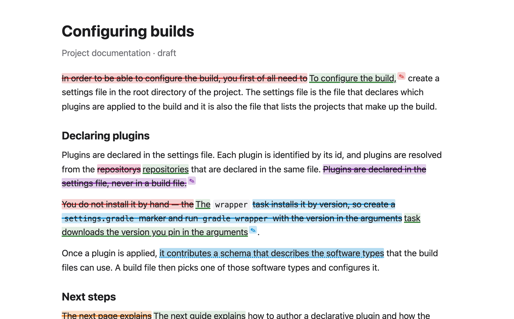
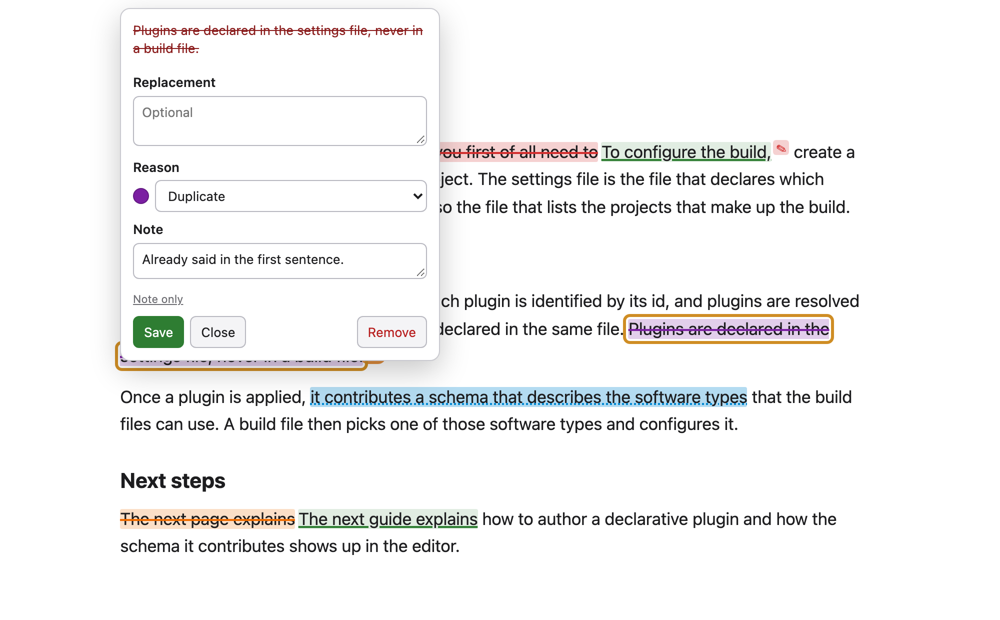
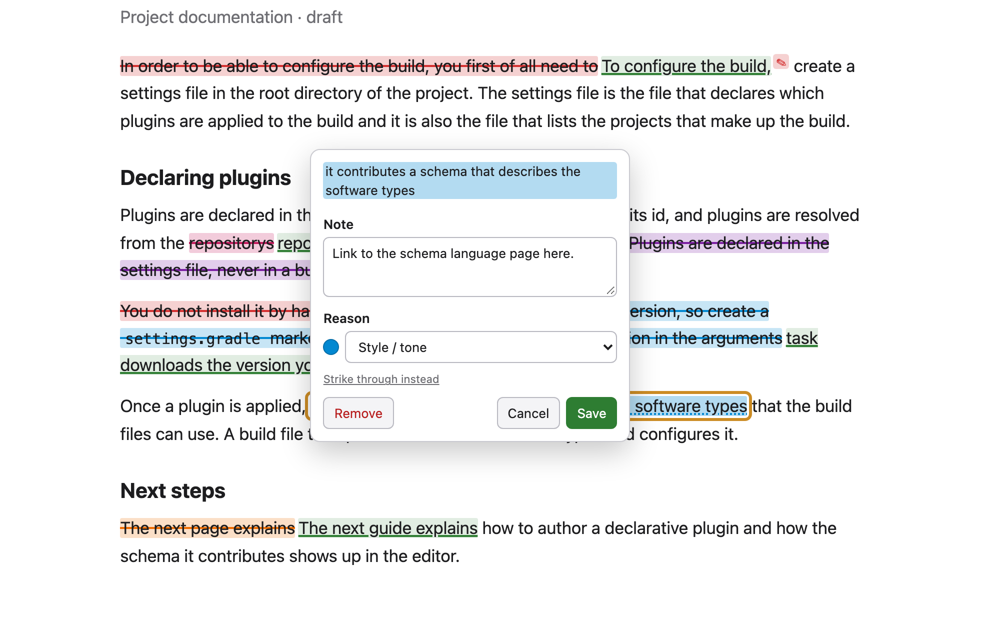
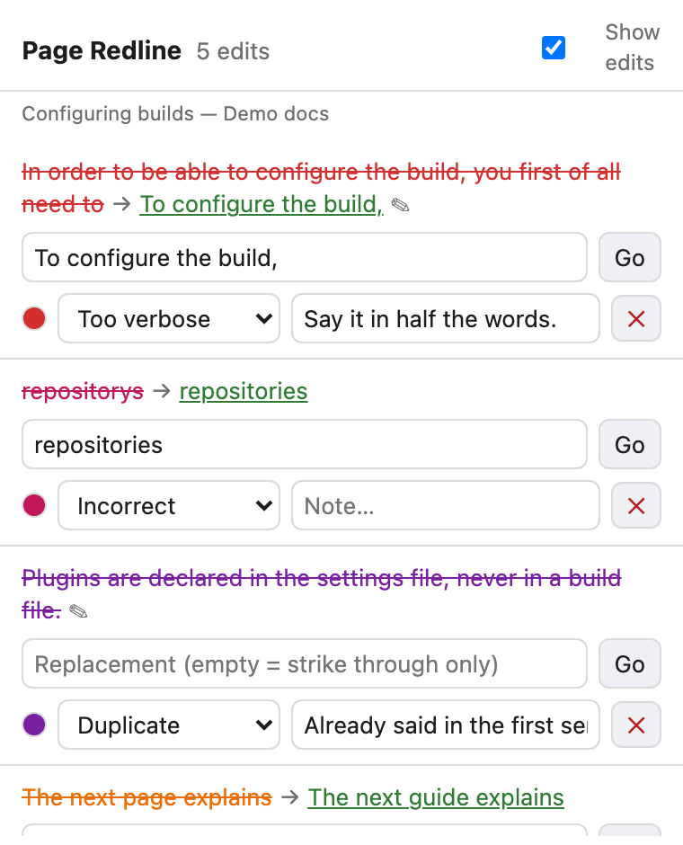
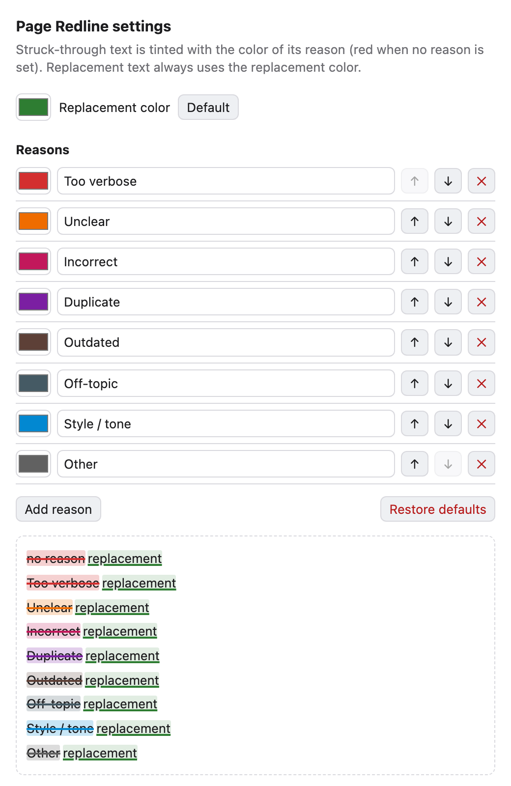
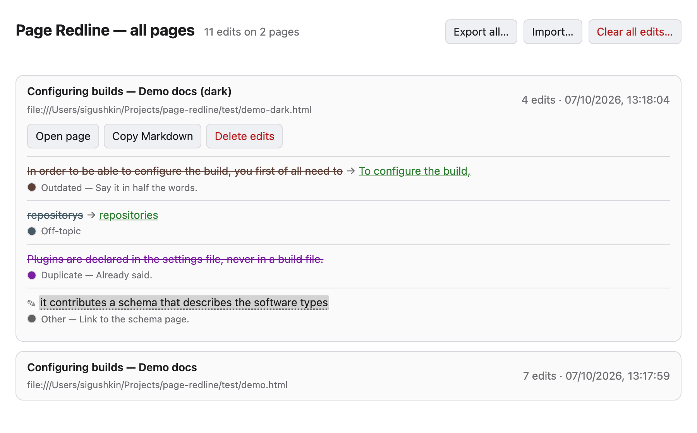

# Page Redline

A small browser extension for **preparing edits to a web page without touching the page**.
Select text, mark it as invalid, and it is struck through in place. Type a replacement and it
appears right after the struck text. Record *why* with a reason and a note. Everything is
remembered per page and listed in the toolbar popup, ready to hand to whoever edits the source.

Works in Chrome (and Chromium-based browsers) and Firefox. No account, no server: all data
stays in the browser's extension storage.



## Features

- **Mark text as invalid.** Select any text on a page, right-click, choose *Mark as invalid…*,
  or press **Alt+Shift+M**. The selection is struck through. Selections may span links, bold
  text and other inline markup.
- **Show the replacement inline.** Type the new wording and it is shown immediately after the
  struck text, underlined in the replacement color. Leave it empty to only strike through.
- **Add a note without changing anything.** Select text, choose *Add a note…* (or press
  **Alt+Shift+N**) and type the note. The text is highlighted, not struck, in the reason's
  color. Hover to read the note, click to open it. A single link in the card turns a note
  into a strikethrough or a strikethrough into a note, keeping the text and reason.
- **See where the notes are.** A struck-through mark that carries a note shows a small ✎
  badge after it, in the mark's color, with the note as its tooltip. The popup shows the
  same badge next to such edits.
- **Record the reason.** Pick a reason (*Too verbose*, *Unclear*, *Incorrect*, *Duplicate*,
  *Outdated*, *Off-topic*, *Style / tone*, *Other*) and add a free-text note. The struck text
  is tinted with the reason's color, so the kind of problem is visible at a glance. The
  reason you chose last is preselected for the next edit.
- **Edit later.** Click any mark to reopen its editor and change the replacement, reason or
  note, or remove the mark. Removing restores the page exactly, since marks only wrap the
  page's own text.
- **Edits survive reloads.** Edits are stored per page and re-applied when you return. They
  are anchored by the exact text plus as much surrounding context as it takes to make the
  spot unique on the page, so small layout changes are tolerated and repeated phrases, even
  inside repeated paragraphs, are told apart. If the text disappears, the edit is listed
  greyed out until it comes back.
- **See all edits in the popup.** The toolbar popup lists every edit on the current page:
  old text, replacement, reason and note, all editable inline. Jump to an edit on the page,
  remove one, clear all, or copy the whole list as Markdown or JSON.
- **Hide and show.** The toggle in the popup hides every mark on every page, so you can read
  the page as if untouched. Edits are kept while hidden.
- **All pages in one place.** *All pages…* in the popup opens a screen listing every page
  that has edits, newest first, with its edits, an *Open page* button and per-page Markdown
  copy and delete. From there you can **export everything** to a JSON file (edits plus your
  reasons and colors), **import** such a file on another machine (merged by edit id, so
  re-importing is harmless), or **clear all edits** on all pages.
- **Your own reasons and colors.** The settings page lets you rename, recolor, reorder, add
  and remove reasons, and choose the replacement color (green by default), with a live
  preview.

<p>
  
  
</p>
<p>
  
  
</p>

## Installation

Page Redline is not in the extension stores yet, so it is installed from this repository.
Clone it or download it as a zip and unpack it:

```
git clone https://github.com/h0tk3y/page-redline.git
```

### Chrome, Edge, Brave and other Chromium browsers

1. Open `chrome://extensions` (`edge://extensions`, `brave://extensions`).
2. Turn on **Developer mode** (top right).
3. Click **Load unpacked** and pick the `page-redline` folder.

The browser will remind you about developer-mode extensions on startup; that is expected for
an extension installed outside the store. To update, `git pull` and click the extension's
reload button on the same page.

### Firefox

1. Open `about:debugging#/runtime/this-firefox`.
2. Click **Load Temporary Add-on…** and pick `manifest.json` inside the folder.
3. Click the Page Redline toolbar icon, open **Permissions**, and allow access to the sites
   you want to edit. Firefox does not grant site access to extensions by default. Reload the
   page afterwards.

A temporary add-on is removed when Firefox quits. For a permanent install, the extension has
to be signed through addons.mozilla.org (free, "unlisted" self-distribution); the resulting
`.xpi` can then be installed by opening it in Firefox.

## Using it

1. Select text on the page, then right-click and choose **Mark as invalid…** (or press
   **Alt+Shift+M**) to strike it through, or **Add a note…** (**Alt+Shift+N**) to only attach
   a note. While the editor card is open, pressing either shortcut flips that mark between
   strikethrough and note, so **Alt+Shift+M twice** turns the new mark into a note. Shortcuts
   can be changed at `chrome://extensions/shortcuts` or, in Firefox, under *Manage Extension
   Shortcuts* on the add-ons page.
2. In the editor that opens, type the replacement or the note, pick a reason.
   **Enter** saves, **Esc** closes.
3. Click any mark, or the ✎ badge after it, at any time to edit or remove it.
4. Open the toolbar popup for the full list. Click an edit's text to jump to it on the
   page; use **Copy Markdown** to paste the list into an issue or a message:

   ```
   - ~~In order to be able to configure the build, you first of all need to~~ → To configure the build, — _Too verbose; Say it in half the words._
   - ~~repositorys~~ → repositories — _Incorrect_
   - ~~Plugins are declared in the settings file, never in a build file.~~ (remove) — _Duplicate; Already said in the first sentence._
   - ✎ “it contributes a schema that describes the software types” — Link to the schema language page here. _(Style / tone)_
   ```
5. **Reasons…** in the popup (or the extension's options page) opens the settings.
6. **All pages…** in the popup lists every page with edits, with export, import and clear-all.



### After updating the extension

Changes to `manifest.json`, `background.js`, `shared.js` or `content.js` only take effect
after you **reload the extension** (`chrome://extensions` → reload, or `about:debugging` →
Reload) and then reload the open pages. The popup is read from disk on every open, so it can
look up to date while the rest is stale.

## Privacy

Edits and settings are stored with the browser's extension storage on your machine only,
along with each page's URL and title. The extension makes no network requests; the only way
data leaves the browser is the export file you download yourself. It asks for access to all sites so that the
context-menu entry works on any page.

## Development

Plain JavaScript, no build step.

- `manifest.json` — Manifest V3. `background.scripts` is for Firefox, `background.service_worker`
  for Chrome; each browser ignores the other key (Chrome logs a warning).
- `background.js` — the context-menu entry and the keyboard shortcut, both forwarded to the
  content script.
- `shared.js` — settings schema (visibility, reasons with colors, replacement color, last
  reason) and defaults.
- `content.js` / `content.css` — marking, inline editor (shadow DOM), storage, anchoring.
- `popup.html` / `popup.js` — the edit list and the show/hide toggle.
- `options.html` / `options.js` — the settings page.
- `pages.html` / `pages.js` — all pages with edits; export, import, clear all.

### Tests

```
./test/run.sh
```

Runs `test/smoke.html` in headless Chrome and prints PASS/FAIL per check. The page stubs the
extension API, so it exercises the content script's marking, replacement rendering,
removal, re-anchoring, visibility and colors without installing the extension.

```
CHROME_BIN="/path/to/Google Chrome for Testing" node test/e2e.mjs
CHROME_BIN="/path/to/Google Chrome for Testing" node test/screenshots.mjs
```

The first loads the real unpacked extension into a headless Chrome and drives it over the
DevTools protocol: pings the content script, checks the context menu, marks a selection,
lists edits, toggles visibility, reloads the page and checks re-anchoring, and opens the
popup and options pages. The second regenerates the screenshots in `docs/`. Branded Google
Chrome 137+ ignores `--load-extension`, so point `CHROME_BIN` at Chrome for Testing
(`npx @puppeteer/browsers install chrome@stable`) or Chromium.
